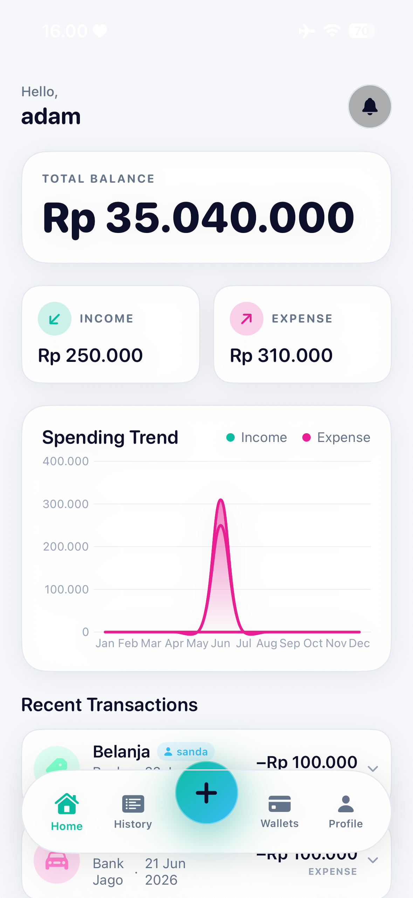
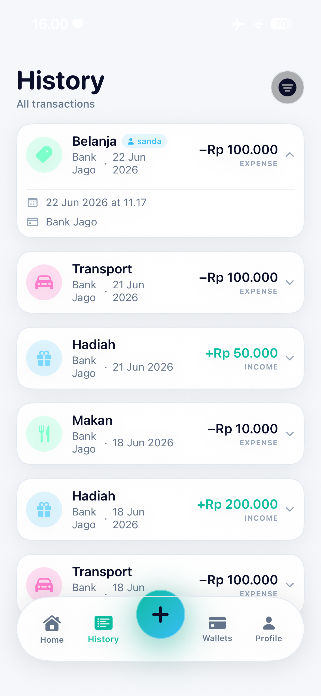
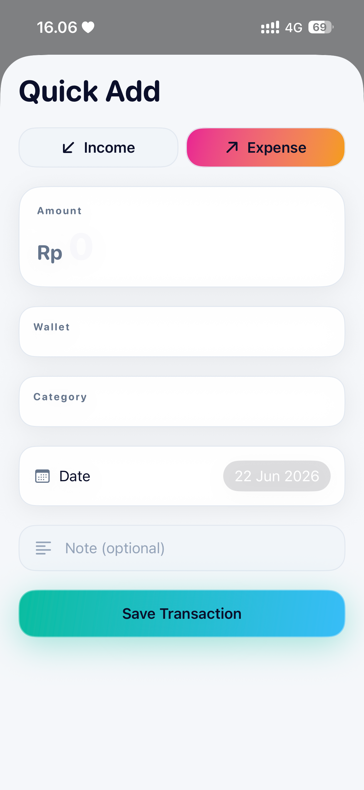
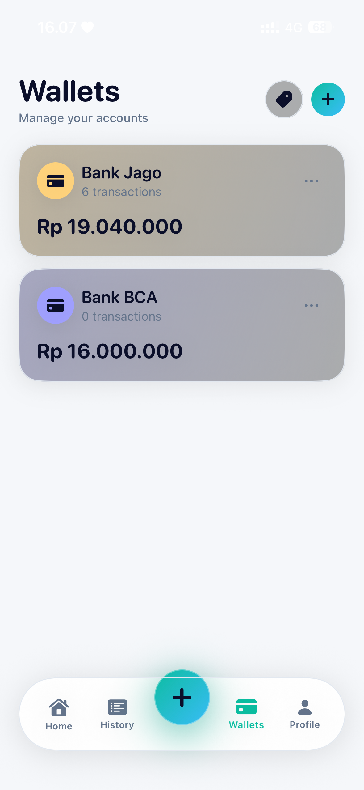
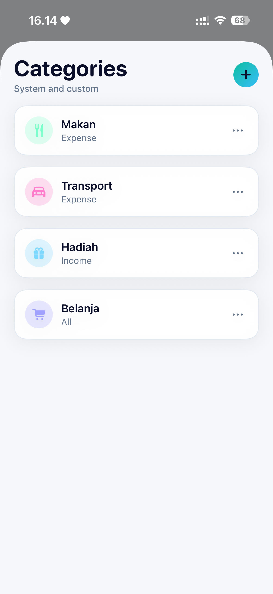
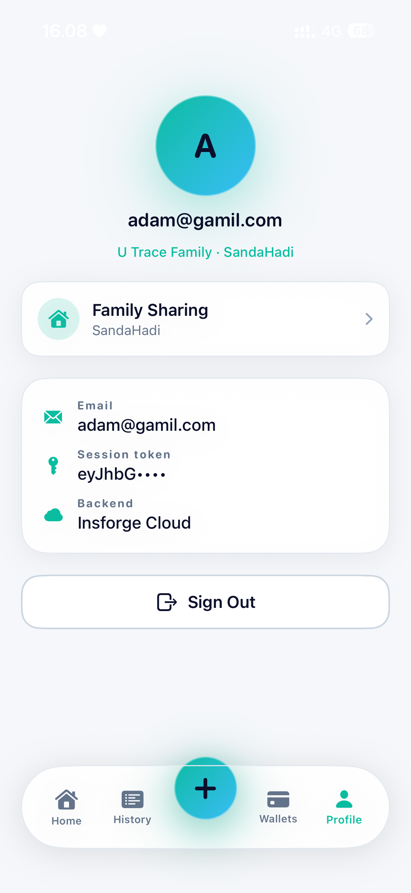

# U Trace — Personal Finance Tracker

> A beautiful, family-friendly personal finance app built with SwiftUI and a glass morphism design system.

---

## Screenshots

| Dashboard | Transaction History | Add Transaction |
|:---------:|:-------------------:|:---------------:|
|  |  |  |

| Wallets | Categories | Family Sharing |
|:-------:|:----------:|:--------------:|
|  |  |  |

> **How to add screenshots:** Run the app in the iOS Simulator, navigate to each screen, then press **Cmd + S** (or `File → Save Screenshot`) to save a PNG. Rename and drop the files into the `screenshots/` folder.

---

## Features

### 💰 Wallets
- Create multiple wallets (savings, cash, bank account, etc.)
- Automatic balance tracking — updated on every transaction
- Color-coded for quick visual identification

### 📊 Dashboard
- Total balance across all wallets at a glance
- Monthly income vs. expense summary cards
- 12-month spending trend chart
- Recent transaction list with quick preview

### 📋 Transaction History
- Paginated transaction list with infinite scroll
- Tap any row to **expand** and see full detail (date, wallet, note)
- Filter by wallet, category, type (income/expense), or date range
- Long-press to delete a transaction
- Pull-to-refresh

### 🏷️ Categories
- System categories pre-seeded on first login (Salary, Food, Transport, etc.)
- Create custom categories with icon and color picker
- Scoped per transaction type (Income / Expense / Both)

### 👨‍👩‍👧 Family Sharing
- Create a family group and share an invite code
- All family members see a **unified wallet and transaction view**
- Creator badge on each transaction shows which member added it
- Migrate existing solo data into the family on join

### 🔐 Authentication
- Email + password registration and login
- JWT session stored securely in iOS Keychain
- Auto-refresh token, 30-day inactivity logout

---

## Tech Stack

| Layer | Technology |
|---|---|
| Language | Swift 6 |
| UI Framework | SwiftUI (iOS 17+) |
| State management | `@Observable` (Swift Observation framework) |
| Concurrency | Swift `async`/`await` |
| Backend | [Insforge](https://insforge.app) — PostgREST-style BaaS |
| Auth | Insforge Auth (JWT) |
| Database | PostgreSQL via Insforge (Row-Level Security enabled) |
| Credential storage | iOS Keychain |
| Charts | Swift Charts (native) |

---

## Architecture

```
U Trace/
├── App/
│   ├── AppEnvironment.swift      # Dependency container (@Observable)
│   └── RootView.swift            # Auth gate
├── DesignSystem/                 # Glass morphism tokens & components
│   ├── Theme.swift               # Colors, spacing, radius
│   ├── Typography.swift          # Font scale
│   ├── GlassCard.swift           # Reusable glass card modifier
│   └── Motion.swift              # Animation presets
├── Features/
│   ├── Auth/                     # Login · Register
│   ├── Dashboard/                # Overview screen
│   ├── Transactions/             # History, add sheet, filter
│   ├── Wallets/                  # Wallet list & editor
│   ├── Categories/               # Category list & editor
│   ├── Family/                   # Family create/join/members
│   ├── Profile/                  # Account & settings
│   └── Shell/                    # TabView + FAB
├── Models/
│   └── AppModels.swift           # All value-type domain models
└── Services/
    ├── Auth/                     # AuthService, KeychainStore, SessionStore
    ├── Networking/               # InsforgeAPIClient, InsforgeConfig
    └── Repositories/             # Protocol + Insforge implementations
```

---

## Getting Started

### Prerequisites

- Xcode 16+
- iOS 17+ target device or simulator
- An [Insforge](https://insforge.app) project

### 1. Clone the repository

```bash
git clone https://github.com/YOUR_USERNAME/u-trace.git
cd u-trace
```

### 2. Configure the backend

Copy the example config and fill in your Insforge credentials:

```bash
cp "U Trace/Services/Networking/InsforgeConfig.example.swift" \
   "U Trace/Services/Networking/InsforgeConfig.swift"
```

Open `InsforgeConfig.swift` and replace the placeholders:

```swift
enum InsforgeConfig {
    static let baseURLString = "https://YOUR_PROJECT_ID.REGION.insforge.app"
    static let anonKey       = "YOUR_ANON_KEY_HERE"
}
```

> `InsforgeConfig.swift` is listed in `.gitignore` and will **never** be committed.

### 3. Set up database tables

Run the following in your Insforge SQL editor:

```sql
-- Wallets
CREATE TABLE wallets (
    id              uuid PRIMARY KEY DEFAULT gen_random_uuid(),
    owner_user_id   uuid NOT NULL,
    family_id       uuid,
    name            text NOT NULL,
    initial_balance numeric DEFAULT 0,
    balance         numeric DEFAULT 0,
    color_hex       text NOT NULL,
    created_at      timestamptz DEFAULT now()
);

-- Categories
CREATE TABLE categories (
    id            uuid PRIMARY KEY DEFAULT gen_random_uuid(),
    owner_user_id uuid,          -- NULL = system category
    name          text NOT NULL,
    icon_name     text NOT NULL,
    color_hex     text NOT NULL,
    scope         text NOT NULL, -- INCOME | EXPENSE | ALL
    is_system     bool DEFAULT false,
    created_at    timestamptz DEFAULT now()
);

-- Transactions
CREATE TABLE transactions (
    id            uuid PRIMARY KEY DEFAULT gen_random_uuid(),
    owner_user_id uuid NOT NULL,
    family_id     uuid,
    created_by    uuid,
    wallet_id     uuid NOT NULL,
    category_id   uuid NOT NULL,
    amount        numeric NOT NULL,
    type          text NOT NULL,  -- INCOME | EXPENSE
    date          timestamptz NOT NULL,
    note          text,
    created_at    timestamptz DEFAULT now()
);

-- Families
CREATE TABLE families (
    id            uuid PRIMARY KEY DEFAULT gen_random_uuid(),
    name          text NOT NULL,
    owner_user_id uuid NOT NULL,
    invite_code   text NOT NULL UNIQUE,
    created_at    timestamptz DEFAULT now()
);

-- Family Members
CREATE TABLE family_members (
    id           uuid PRIMARY KEY DEFAULT gen_random_uuid(),
    family_id    uuid NOT NULL REFERENCES families(id) ON DELETE CASCADE,
    user_id      uuid NOT NULL,
    display_name text,
    role         text NOT NULL DEFAULT 'member', -- owner | member
    joined_at    timestamptz DEFAULT now()
);
```

### 4. Enable Row-Level Security

```sql
-- Enable RLS
ALTER TABLE wallets          ENABLE ROW LEVEL SECURITY;
ALTER TABLE transactions     ENABLE ROW LEVEL SECURITY;
ALTER TABLE categories       ENABLE ROW LEVEL SECURITY;
ALTER TABLE families         ENABLE ROW LEVEL SECURITY;
ALTER TABLE family_members   ENABLE ROW LEVEL SECURITY;

-- Helper function (avoids recursion)
CREATE OR REPLACE FUNCTION my_family_id()
RETURNS UUID LANGUAGE SQL SECURITY DEFINER STABLE AS $$
  SELECT family_id FROM family_members WHERE user_id = auth.uid() LIMIT 1
$$;
GRANT EXECUTE ON FUNCTION my_family_id() TO authenticated;

-- Wallets: own rows or same family
CREATE POLICY wallet_select ON wallets FOR SELECT TO authenticated
  USING (owner_user_id = auth.uid() OR (family_id IS NOT NULL AND family_id = my_family_id()));
CREATE POLICY wallet_insert ON wallets FOR INSERT TO authenticated WITH CHECK (owner_user_id = auth.uid());
CREATE POLICY wallet_update ON wallets FOR UPDATE TO authenticated USING (owner_user_id = auth.uid()) WITH CHECK (owner_user_id = auth.uid());
CREATE POLICY wallet_delete ON wallets FOR DELETE TO authenticated USING (owner_user_id = auth.uid());

-- Transactions: own rows or same family
CREATE POLICY tx_select ON transactions FOR SELECT TO authenticated
  USING (owner_user_id = auth.uid() OR (family_id IS NOT NULL AND family_id = my_family_id()));
CREATE POLICY tx_insert ON transactions FOR INSERT TO authenticated WITH CHECK (owner_user_id = auth.uid());
CREATE POLICY tx_update ON transactions FOR UPDATE TO authenticated USING (owner_user_id = auth.uid()) WITH CHECK (owner_user_id = auth.uid());
CREATE POLICY tx_delete ON transactions FOR DELETE TO authenticated USING (owner_user_id = auth.uid());

-- Categories: system + own + family members' categories
CREATE POLICY cat_select ON categories FOR SELECT TO authenticated
  USING (is_system = true OR owner_user_id = auth.uid()
    OR owner_user_id IN (SELECT user_id FROM family_members WHERE family_id = my_family_id()));
CREATE POLICY cat_insert ON categories FOR INSERT TO authenticated WITH CHECK (owner_user_id = auth.uid());
CREATE POLICY cat_update ON categories FOR UPDATE TO authenticated USING (owner_user_id = auth.uid()) WITH CHECK (owner_user_id = auth.uid());
CREATE POLICY cat_delete ON categories FOR DELETE TO authenticated USING (owner_user_id = auth.uid());

-- Families: readable by all authenticated (needed for invite-code lookup)
CREATE POLICY family_select ON families FOR SELECT TO authenticated USING (true);
CREATE POLICY family_insert ON families FOR INSERT TO authenticated WITH CHECK (owner_user_id = auth.uid());
CREATE POLICY family_update ON families FOR UPDATE TO authenticated USING (owner_user_id = auth.uid()) WITH CHECK (owner_user_id = auth.uid());
CREATE POLICY family_delete ON families FOR DELETE TO authenticated USING (owner_user_id = auth.uid());

-- Family members
CREATE POLICY fm_select ON family_members FOR SELECT TO authenticated
  USING (user_id = auth.uid() OR family_id = my_family_id());
CREATE POLICY fm_insert ON family_members FOR INSERT TO authenticated WITH CHECK (user_id = auth.uid());
CREATE POLICY fm_delete ON family_members FOR DELETE TO authenticated
  USING (user_id = auth.uid() OR EXISTS (SELECT 1 FROM families WHERE id = family_members.family_id AND owner_user_id = auth.uid()));
```

### 5. Open and run

```
open "U Trace.xcodeproj"
```

Select your target device/simulator and press **Cmd + R**.

---

## Design System

The app uses a custom **glass morphism** design system built on top of SwiftUI materials.

| Token | Value |
|---|---|
| Primary background | `.ultraThinMaterial` |
| Accent Mint | `#7CFFCB` |
| Accent Sky | `#7CD8FF` |
| Accent Pink | `#FF7CCB` |
| Danger | `#FF6B7A` |
| Corner radius (card) | `16pt` |
| Corner radius (button) | `14pt` |

---

## License

MIT © Nur Hadi Saputra
